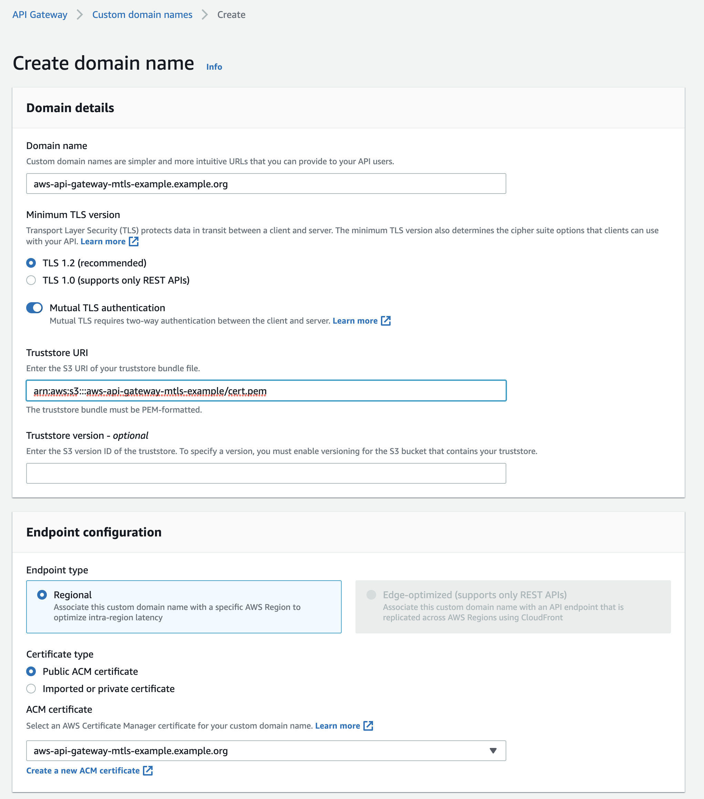

# Aws API Gateway with mTLS Example

Example showing how you can use mTLS with the Aws API Gateway. This example creates most neeeded resources on AWS using https://www.serverless.com/.

## Setup

### 1. Create certificates
```bash
./create-certificates.sh
```

### 2. Deployment
```
npm i -g serverless
serverless config credentials --provider aws --key [YOUR AWS ACCESS KEY ID] --secret [YOUR AWS ACCESS KEY SECRET]

yarn install
yarn deploy
```

### 3. Manual Steps

1. Request certificate for the domain you want to run the example on: https://docs.aws.amazon.com/acm/latest/userguide/gs-acm-request-public.html
2. Create a S3 Bucket and upload the ca certificate **mtls/ca/cert.pem**
3. Create custom domain and enable mtls pointing to ca certificate for validation
4. Map custom domain to your API gateway
5. Add CName DNS Entry for your custom domain (https://docs.aws.amazon.com/apigateway/latest/developerguide/http-api-custom-domain-names.html)



## Test 
You can easily test the whole thing with curl:

```
curl --cacert AmazonRootCA1.pem \
  --key mtls/client/key.pem \
  --cert mtls/client/cert.pem \
  https://aws-api-gateway-mtls-example.example.org/
```